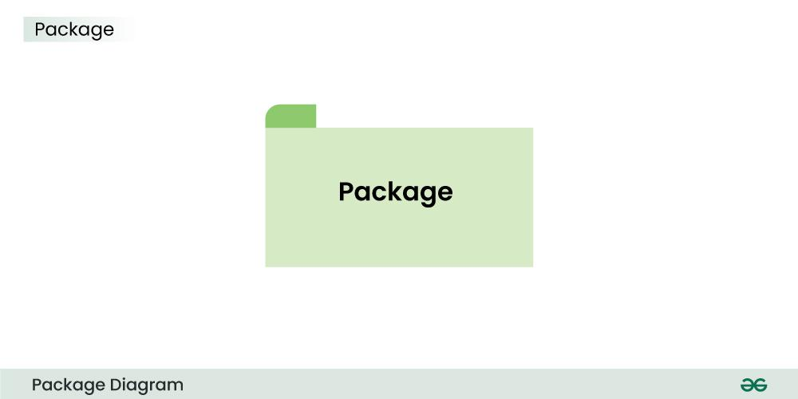
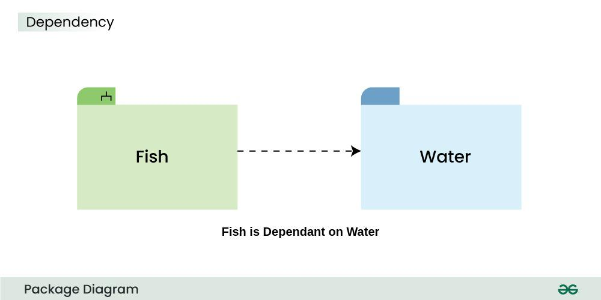
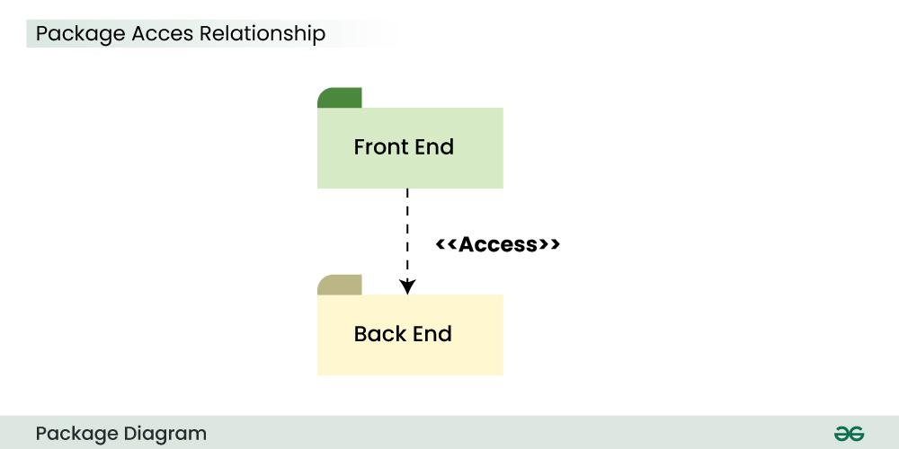
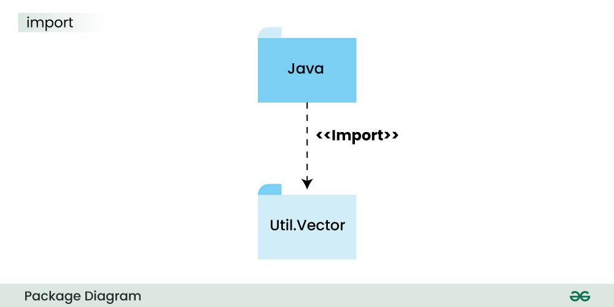
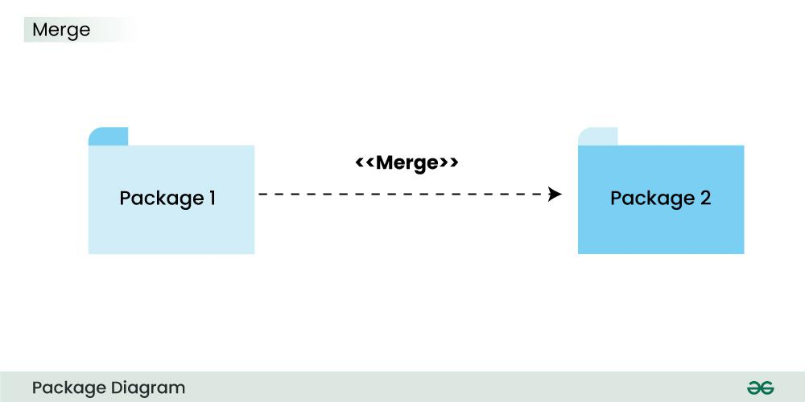

# Diagrama de Pacotes UML

O **Diagrama de Pacotes**, definido pela linguagem UML, visa descrever como os elementos de um sistema estão organizados, distribuídos em agrupamentos lógicos chamados de **pacotes**, e demonstra as dependências entre eles.  
Esse diagrama é amplamente utilizado para separar os módulos, divisões ou camadas da arquitetura de um projeto de software.

---

## 📦 PACOTES

- Agrupam um conjunto de elementos e permitem nomear esses grupos;
- Podem representar um sistema, um subsistema, uma biblioteca, um framework, uma camada de arquitetura, entre outras alternativas;
- Pacotes podem conter outros pacotes;
- Um conector de aninhamento é usado quando os elementos não cabem dentro da representação do pacote ou por questão gráfica.

 **Exemplo:**  
> 
Representação de um pacote em UML

---

## 🏷️ NOMES QUALIFICADOS

- Nomes qualificados são outra forma de demonstrar os elementos contidos em um pacote;
- Apresenta-se desta forma:
"Pacote Principal"::"Pacote Interno"

## 🔗 DEPENDÊNCIA

- Em diversos casos, pacotes contêm dependências entre si;
- Ou seja, algum elemento dentro de um dos pacotes depende de algum elemento contido em outro pacote;

 **Exemplo:**  
> 
O pacote 'Peixe' depende do pacote 'Água'

---

## 📥 DEPENDÊNCIA COM IMPORTAÇÃO

- É possível que um pacote importe elementos de outro pacote;
- Isso pode ser feito usando relacionamentos de dependência, utilizando os estereótipos `≪access≫` e `≪import≫`;
- Estereótipos são uma maneira de atribuir características novas a um elemento ou associação;
- Existem os estereótipos de texto, que não modificam o desenho padrão, são apenas texto entre sinais de menor e maior, assim:  
`≪característica≫`  
- Também existem os estereótipos gráficos, que não mudam o desenho padrão do componente.

### 🔑 ESTEREÓTIPO `≪ACCESS≫`

- Usando o estereótipo `≪access≫`, o elemento é importado para o pacote, **não possuindo visibilidade pública**;
- Ou seja, não é visível como um elemento do pacote fora dele;
- O elemento importado não pode ser importado novamente por outros pacotes, a partir do pacote que o importou.

 **Exemplo:**  
> 
O pacote 'FrontEnd' acessa o pacote 'BackEnd'

### 📤 ESTEREÓTIPO `≪IMPORT≫`

- Usando este estereótipo, o elemento possui **visibilidade pública** no pacote, podendo ser importado por outros pacotes.

 **Exemplo:**  
> 
O pacote 'Java' importa o pacote 'Util.Vector'

---

## 🔄 DEPENDÊNCIA COM MESCLAGEM

- É possível mesclar os elementos de um pacote em outro, utilizando o estereótipo `≪merge≫`;
- Ao utilizar o recurso, todos os elementos do pacote de origem serão incluídos no pacote de destino.

> **Exemplo:**  
> 
