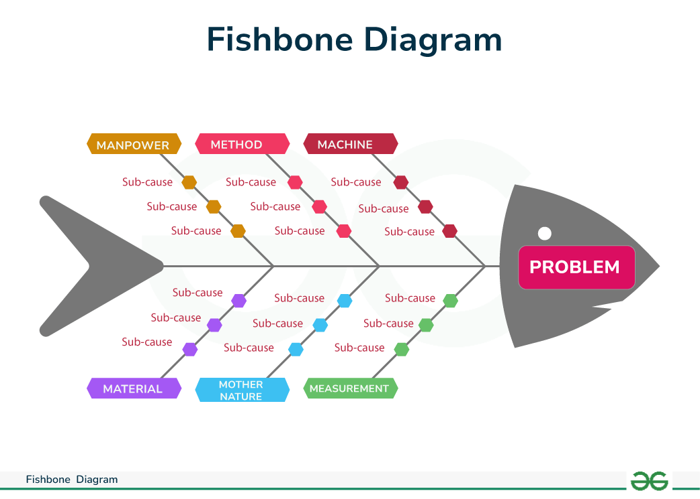

# 🐟 Diagrama Espinha-de-Peixe (Ishikawa)

O **Diagrama Espinha-de-Peixe**, também chamado de **Diagrama de Ishikawa**, é uma ferramenta visual usada para **solução de problemas** e **análise de causas**. Ele é estruturado como o esqueleto de um peixe: o **problema** é posicionado na "cabeça" do peixe e as **potenciais causas** derivam da cabeça como **"espinhas"**.

Essas espinhas representam diversas categorias como **processos**, **materiais**, **medidas**, **pessoas**, **métodos**, etc. Organizar as causas dessa forma ajuda na identificação da **raiz** do problema discutido.

A seguir, veja como o diagrama é estruturado:
  
> 

---

## ELEMENTOS DO DIAGRAMA

- **Cabeça do Peixe**: É o problema definido a ser analisado.
- **Espinha Principal**: Define as principais categorias ou fatores que contribuem ao problema. As categorias comuns incluem:
  - Pessoas
  - Processos
  - Ambiente
  - Equipamento
  - Materiais
- **Espinhas Secundárias**: Derivam da espinha principal, representando fatores específicos ou sub-causas de cada categoria principal.
- **Categorização das causas**: Estes são fatores ou causas de cada espinha secundária, definindo aspectos específicos que contribuem para o problema.

---

## 🔧 COMO MONTAR UM DIAGRAMA ESPINHA-DE-PEIXE

1. **Defina o problema** que precisa ser analisado.
2. **Determine as categorias** que podem contribuir para o problema.
3. **Desenhe a espinha principal**:
   - Em um quadro branco ou papel, desenhe uma linha horizontal representando a espinha principal.
   - Na ponta da espinha, desenhe a **cabeça do peixe** e escreva o problema a ser discutido.
4. **Adicione as categorias**:
   - Desenhe linhas diagonais à espinha principal e defina os nomes das categorias.
5. **Adicione sub-categorias**:
   - Se necessário, adicione sub-categorias derivando das categorias específicas.
6. **Faça um brainstorming** para identificar as causas das categorias e sub-categorias e escreva-as apropriadamente.
7. **Analise as causas**:
   - Defina a relevância de cada causa e identifique as principais.
8. **Desenvolva e implemente soluções** a partir da análise.
9. **Faça revisões contínuas** e atualize o diagrama conforme novas informações surgem ou conforme o processo de solução se desenvolve.

---

O Diagrama Espinha-de-Peixe é uma excelente ferramenta para **identificar e analisar** as causas de problemas, permitindo que equipes colaborem de forma mais estruturada e eficiente.

