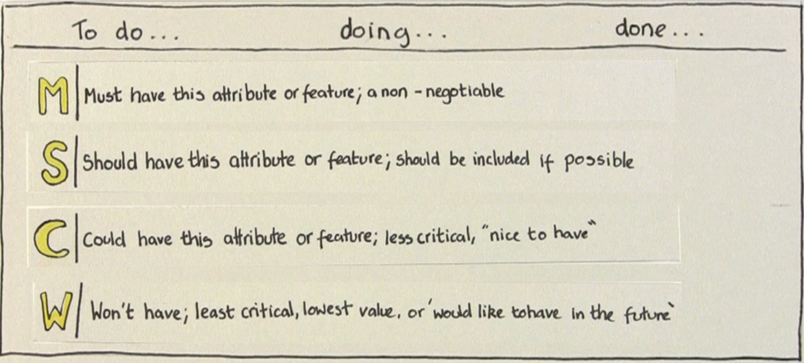
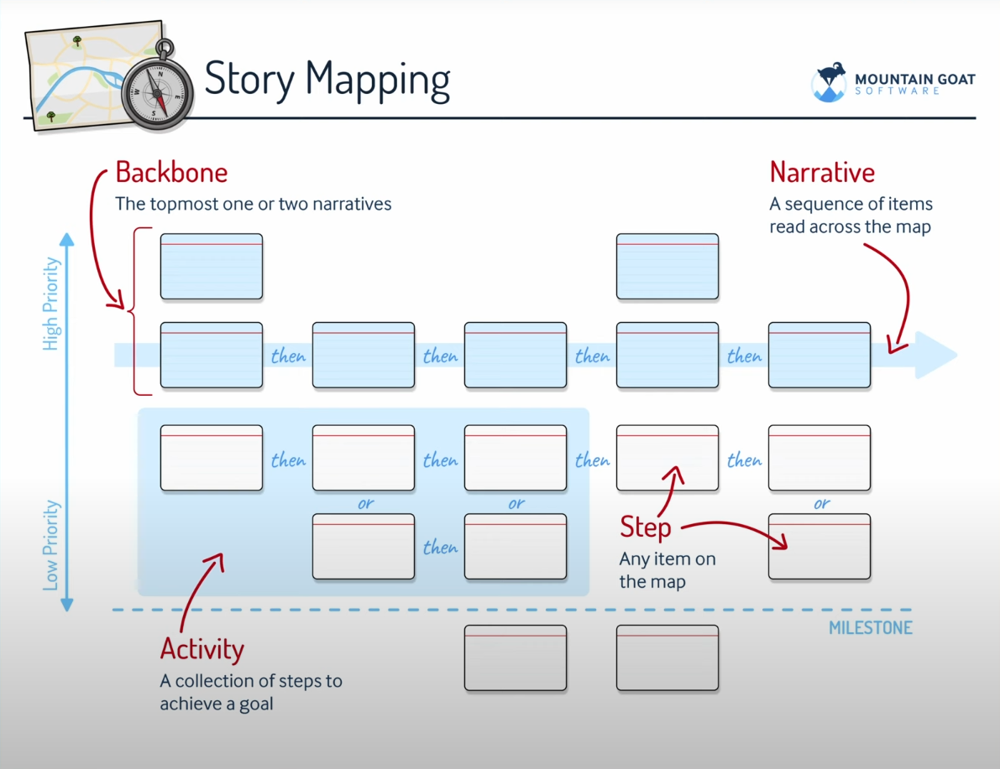
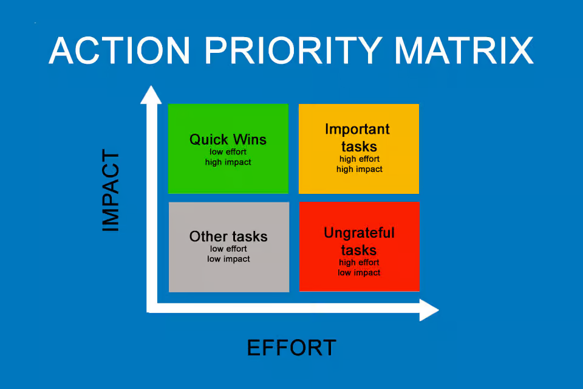

# 📌 Requisitos de Software  

## 1. Introdução  

Requisitos de software são **descrições do que o sistema deve fazer** e **como ele deve funcionar**.  
Eles servem como um "contrato" entre o cliente e a equipe de desenvolvimento.  

- Sem requisitos bem definidos → o sistema pode ser construído errado.  
- Com requisitos claros → maior chance de sucesso no projeto.  

**Exemplo:**  
- Mal definido: *"O sistema deve ser rápido."*  
- Bem definido: *"O sistema deve responder em até 2 segundos em 95% das requisições."*  

---

## 2. Tipos de Requisitos  

### 2.1 Funcionais  
São as **funções que o sistema precisa realizar**.  
- Cadastro de usuário  
- Login e autenticação  
- Geração de relatórios  

👉 Respondem à pergunta: **O que o sistema faz?**  

### 2.2 Não Funcionais  
São restrições e qualidades do sistema.  
- Desempenho (tempo de resposta, consumo de memória)  
- Segurança (criptografia, controle de acesso)  
- Usabilidade (interface amigável, acessibilidade)  

👉 Respondem à pergunta: **Como o sistema deve ser?**  

---

## 3. Elicitação de Requisitos  
  

"Elicitar" significa **levantar, coletar e descobrir requisitos** junto às partes interessadas (*stakeholders*), que podem ser clientes, usuários finais, gestores ou até especialistas do negócio.  

Esse processo geralmente começa em uma reunião inicial chamada **Kick Off** (pontapé inicial).  
➡️ Nela, os principais representantes do cliente e da equipe de desenvolvimento se reúnem para alinhar **objetivos, expectativas e problemas que o sistema precisa resolver**.  

### Principais Técnicas de Elicitação:  
- **Entrevistas**  → conversar diretamente com usuários ou gestores para entender necessidades.  
- **Questionários** → úteis quando há muitos usuários e é preciso coletar respostas em massa.  
- **Observação**  → acompanhar como os usuários realizam suas tarefas no dia a dia.  
- **Prototipação**  → criar esboços ou telas simples que ajudam a validar ideias antes da implementação.  

#### 👉 O objetivo da elicitação não é apenas coletar funcionalidades, mas **entender o problema do cliente** para que a solução desenvolvida realmente atenda às suas necessidades.  
---

## 4. Modelagem e Documentação  

Depois de coletar os requisitos, é preciso **organizar e registrar**.  

### Formas comuns:  
- **Casos de uso (UML)** → mostram interações do usuário com o sistema.  
- **User stories (ágeis)** → pequenas frases que descrevem funcionalidades.  
  - Exemplo: *"Como aluno, quero acessar minhas notas online para acompanhar meu desempenho."*  
- **Backlog de produto** → lista priorizada de requisitos.  

---

## 5. Validação e Verificação  

- **Validação**: verificar se os requisitos realmente atendem às necessidades do cliente.  
- **Verificação**: conferir se os requisitos foram implementados corretamente no sistema.  

📌 Métodos:  
- Revisões com stakeholders.  
- Prototipagem validada.  
- Testes de aceitação.  

---

## 6. Gerenciamento de Requisitos  

Durante o ciclo de vida de um projeto, é comum que os **requisitos mudem**.  
Novas demandas podem surgir, outras se tornarem obsoletas, ou ainda precisarem de ajustes.  
Por isso, não basta só elicitar requisitos: é necessário **gerenciar**.  

### Principais Atividades de Gerenciamento:  
- **Controle de mudanças**    
  - Cada alteração deve ser registrada, avaliada e aprovada antes de ser implementada.  
  - Isso evita que mudanças inesperadas prejudiquem o cronograma ou aumentem custos.  

- **Rastreabilidade**  
  - Significa acompanhar o “caminho” de cada requisito:  
    - Onde surgiu (usuário/cliente)  
    - Onde foi documentado  
    - Onde é implementado no código  
    - Onde é testado e validado  
  - Isso ajuda a garantir que nada importante seja perdido.  

- **Priorização**   
  - Como os recursos (tempo, equipe, orçamento) são limitados, nem todos os requisitos podem ser feitos ao mesmo tempo.  
  - Para decidir o que vem primeiro, uma técnica simples e bastante usada é a **MoSCoW** (ou **Impact/Effort Matrix** no final do documento):  

### A Técnica MoSCoW  
MoSCoW é um acrônimo que ajuda a classificar requisitos em quatro categorias:  
➡️ Significado (imagem em `./assets/RequisitosDeSoftware/MoSCoW.png`):  
  
Retirado de: [Agile in Practice: Prioritisation using MoSCoW](https://www.youtube.com/watch?v=QfZo9cxnQgY)

1. **Must Have (Deve ter)** ✅  
   - Requisitos obrigatórios, sem eles o sistema não funciona.  
   - Exemplo: “O usuário deve conseguir fazer login.”  

2. **Should Have (Deveria ter)** 👍  
   - Muito importantes, mas não críticos. Podem ser entregues depois.  
   - Exemplo: “O sistema deveria ter autenticação em dois fatores.”  

3. **Could Have (Poderia ter)** ✨  
   - Funcionalidades desejáveis, mas opcionais.  
   - Exemplo: “O sistema poderia ter modo escuro.”  

4. **Won’t Have (Não terá por agora)** ❌  
   - Requisitos que foram discutidos, mas decididos para não serem implementados nesta versão.  
   - Exemplo: “Integração com redes sociais não será feita nesta release.”  

👉 Essa técnica ajuda equipes a focarem no que **realmente entrega valor ao usuário primeiro**, deixando extras para depois.  

---

## 7. Boas Práticas  

- Escrever requisitos de forma **clara e objetiva**.  
- Evitar termos ambíguos (*rápido*, *fácil*, *eficiente*).  
- Manter os requisitos sempre **atualizados**.  
- Validar constantemente com o cliente.  

---

## 8. Exemplos Visuais 

### Story Map
O **Story Map** é uma técnica visual usada para **organizar requisitos de software** de forma que todos entendam como o usuário interage com o sistema.  

➡️ Estrutura básica (imagem em `./assets/RequisitosDeSoftware/StoryMap.png`):  
  
Retirado de: [User Story Mapping Tutorial (How to create, read, and use story maps)](https://www.youtube.com/watch?v=uj3PlPDAlHU)

#### Principais Conceitos do Story Map:  
- **Backbone**  → Linha superior com as narrativas principais (grandes funcionalidades).  
- **Narrativa**  → Sequência de passos lida na horizontal (mostra o fluxo da interação do usuário).  
- **Atividade** → Conjunto de passos necessários para alcançar um objetivo.  
- **Step (Passo)**  → Qualquer item no mapa, representando uma ação do usuário.  
- **Prioridade**  → Itens mais importantes ficam no topo (alto valor para o usuário), os menos importantes abaixo.  
- **Milestones**  → Divisões que mostram entregas incrementais do sistema.  

#### Por que usar Story Mapping?  
- Ajuda a **visualizar o produto inteiro**.  
- Facilita a **priorização de funcionalidades**.  
- Mostra como os **requisitos se conectam** em jornadas de usuário.  
- Útil em **times ágeis**, pois conecta requisitos com releases e backlog.  

### Matriz de Ação e Prioridade  

A **Action Priority Matrix** é uma ferramenta visual usada para **priorizar requisitos, tarefas ou funcionalidades** com base em dois critérios:  
- **Esforço (Effort)** → quanto trabalho ou recurso é necessário.  
- **Impacto (Impact)** → quanto valor ou benefício traz para o usuário ou negócio.  

➡️ Estrutura básica (imagem em `./assets/RequisitosDeSoftware/ActionPriorityMatrix.png`):  
  

#### Quadrantes da Matriz:  

- **Quick Wins (Vitórias Rápidas)** 🟩  
  - Baixo esforço, alto impacto.  
  - São as tarefas que devem ser priorizadas primeiro.  

- **Important Tasks (Tarefas Importantes)** 🟨  
  - Alto esforço, alto impacto.  
  - Exigem mais tempo e recursos, mas trazem grande valor.  

- **Other Tasks (Outras Tarefas)** ⬜  
  - Baixo esforço, baixo impacto.  
  - Podem ser feitas se sobrar tempo, mas não são prioridade.  

- **Ungrateful Tasks (Tarefas Ingratas)** 🟥  
  - Alto esforço, baixo impacto.  
  - Geralmente devem ser evitadas ou deixadas por último.  

#### Por que usar essa matriz?  
- Ajuda a **decidir onde investir tempo e recursos**.  
- Facilita a **gestão de requisitos** quando há muitas demandas.  
- Apoia a **tomada de decisão ágil** em times de software.  

---

## 9. Conclusão  

- Os requisitos de software são a **base do desenvolvimento**.  
- Um projeto com requisitos mal definidos tende a falhar.  
- Aprender a elicitar, documentar, validar e gerenciar requisitos é essencial para qualquer engenheiro de software.  

---

### 10. Links/Bibliografia

Levantamento de Requisitos: O Guia Definitivo para QUALQUER PROJETO na Programação: https://www.youtube.com/watch?v=xEdGAC0qzgY  
Requisito Funcional e Não Funcional de Software: entenda a diferença.:https://www.youtube.com/watch?v=YLd6AWKVyas  
Definition of ready vs Definition of done | CT Academy: https://www.youtube.com/watch?v=kfSeI6Qvt_Q    
User Story Mapping Tutorial (How to create, read, and use story maps): https://www.youtube.com/watch?v=uj3PlPDAlHU    
Requisito Funcional e Não Funcional de Software: entenda a diferença.:https://www.youtube.com/watch?v=YLd6AWKVyas  
Agile in Practice: Prioritisation using MoSCoW: https://www.youtube.com/watch?v=QfZo9cxnQgY