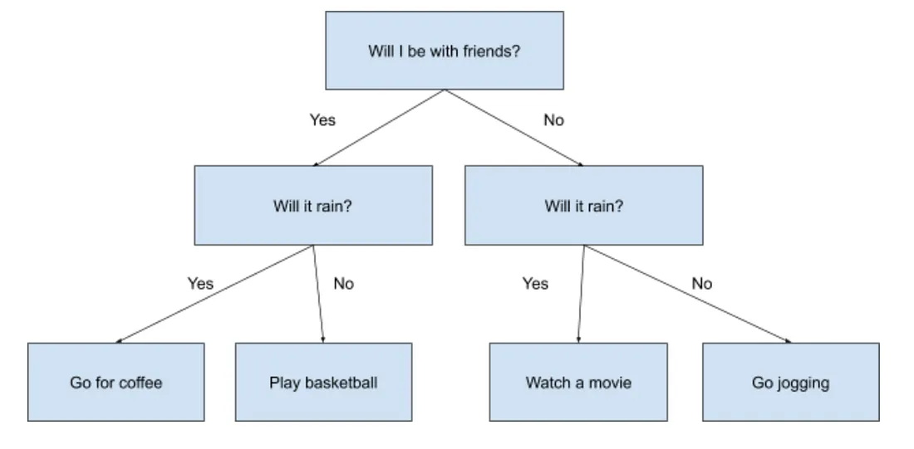
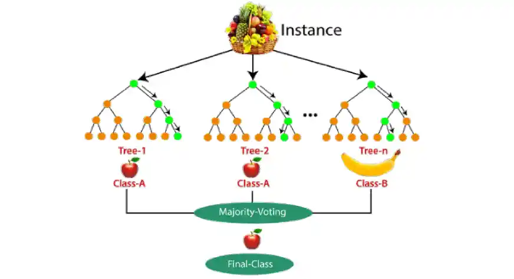
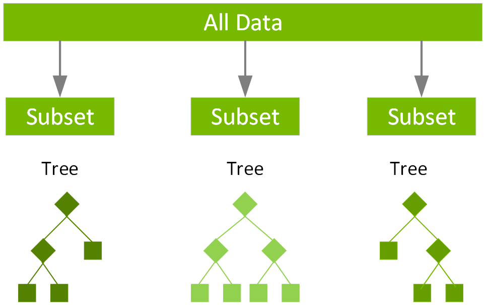
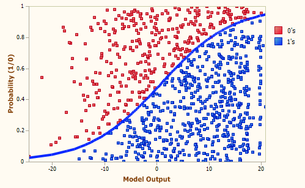

# 🌲 Modelos de Classificação no Scikit-Learn

O **Scikit-Learn** oferece uma ampla variedade de algoritmos de classificação prontos para uso, permitindo treinar e avaliar modelos de forma rápida e eficiente.  
Abaixo, exploramos os principais tipos de classificadores disponíveis:

---

## 🔹 Árvores de Decisão (Decision Trees)

### O que são?
Árvores de decisão são modelos baseados em regras hierárquicas que dividem os dados em regiões homogêneas de acordo com os atributos.  

#### Vantagens
- Fácil interpretação e visualização.  
- Não requer normalização dos dados.  
- Pode lidar com variáveis numéricas e categóricas.  

####  Exemplo Visual
<p>  </p>
<p>  </p>

### Exemplo com Scikit-Learn
```python
from sklearn.tree import DecisionTreeClassifier

model = DecisionTreeClassifier(max_depth=3, random_state=42)
model.fit(X_train, y_train)
y_pred = model.predict(X_test)
```
### 🔹 Florestas Aleatórias (Random Forest)
### O que são?
Conjunto de várias árvores de decisão treinadas em subconjuntos dos dados, cujas previsões são combinadas.
<p>  </p>
#### Vantagens
- Reduz o risco de overfitting.

- Melhor desempenho que árvores únicas.

```python
Copy code
from sklearn.ensemble import RandomForestClassifier

model = RandomForestClassifier(n_estimators=100, random_state=42)
model.fit(X_train, y_train)
```
## 🔹 Gradient Boosting (XGBoost, LightGBM, etc.)
O que é?
Método baseado em boosting, onde modelos fracos (árvores pequenas) são treinados sequencialmente, cada um corrigindo os erros do anterior.

<p>  </p>

#### Vantagens
- Excelente desempenho em competições de ML.

- Muito eficaz em dados tabulares.

Exemplo com Scikit-Learn
```python
from sklearn.ensemble import GradientBoostingClassifier

model = GradientBoostingClassifier()
model.fit(X_train, y_train)
```

## 🔹 Support Vector Machines (SVM)
O que são?
Algoritmos que buscam um hiperplano ótimo para separar classes no espaço de atributos.

#### Vantagens
- Eficaz em espaços de alta dimensão.

- Funciona bem com margens claras entre classes.

#### Quando utilizar?
Dados com classes bem separadas.

Problemas de alta dimensionalidade.

```python
from sklearn.svm import SVC

model = SVC(kernel="rbf", C=1, gamma="scale")
model.fit(X_train, y_train)
```

## 🔹 K-Nearest Neighbors (KNN)
### O que é?
Classificador baseado em distância: um novo ponto é classificado de acordo com a maioria dos rótulos dos seus vizinhos mais próximos.

<p>  </p>

#### Vantagens
- Simples e intuitivo.

- Funciona bem com poucos atributos.

> ⚠️ Importante: KNN é sensível à escala dos dados → usar Feature Scaling.

```python
Copy code
from sklearn.neighbors import KNeighborsClassifier

model = KNeighborsClassifier(n_neighbors=5)
model.fit(X_train, y_train)
```
## 🔹 Regressão Logística
Apesar do nome, é um modelo de classificação linear tambem.
Ele estima a probabilidade de uma amostra pertencer a uma classe utilizando a função sigmoide.

<p>  </p>

#### Vantagens
- Simples, rápido e interpretável.

- Útil como baseline.

```python
Copy code
from sklearn.linear_model import LogisticRegression

model = LogisticRegression()
model.fit(X_train, y_train)
```

📊 Comparação entre Modelos de Classificação

| Modelo                  | Vantagens                                       | Desvantagens                                  | Quando Usar                                       |
| ----------------------- | ----------------------------------------------- | --------------------------------------------- | ------------------------------------------------- |
| **Árvore de Decisão**   | Fácil interpretação, lida com dados categóricos | Pode sofrer overfitting                       | Quando interpretabilidade é importante            |
| **Random Forest**       | Reduz overfitting, robusto                      | Mais lento que árvore única                   | Dados tabulares gerais                            |
| **SVM**                 | Bom em alta dimensão, margens claras            | Lento em datasets muito grandes, exige tuning | Classes bem separadas, alta dimensão              |
| **KNN**                 | Simples, não precisa de treino intensivo        | Sensível à escala e a ruído                   | Poucos atributos, dataset pequeno                 |
| **Regressão Logística** | Rápida, interpretável                           | Limitada a separação linear                   | Como baseline para comparação                     |
| **Gradient Boosting**   | Alta performance, ótimo em dados tabulares      | Mais complexo, tuning necessário              | Competição de ML, quando performance é prioridade |
