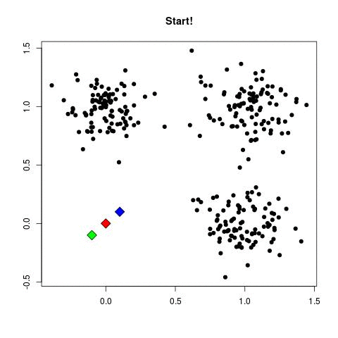
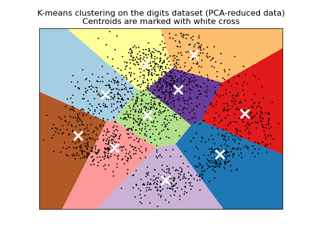

# 📊 Clustering no Scikit-Learn

O **clustering** é uma técnica de **aprendizado não supervisionado**, usada para **agrupar dados similares** sem rótulos predefinidos.  

No Scikit-Learn, temos vários algoritmos populares de clustering, incluindo:

- K-Means  
- Agglomerative (Hierárquico)  
- DBSCAN  
- Mean Shift  

Este guia cobre os conceitos, fórmulas e exemplos práticos de cada técnica.

---

## 🔹 K-Means Clustering

### O que é?
K-Means busca dividir os dados em **K clusters**, minimizando a distância intra-cluster.  
Cada cluster é representado pelo **centroide** (média dos pontos do cluster).

### Fórmula
```math 
\text{SSE} = \sum_{i=1}^{K} \sum_{x \in C_i} \| x - \mu_i \|^2 
```

Onde:  
- $\\K`$ = número de clusters  
- $\\C_i`$ = cluster \(i\)  
- $\mu_i`$ = centroide do cluster \(i\)  
- $\\| x - \mu_i \|^2`$ = distância quadrática entre o ponto \(x\) e o centroide

### Exemplo em Python
```python
from sklearn.cluster import KMeans
import numpy as np

# Dados de exemplo
X = np.array([[1, 2], [1, 4], [1, 0],
              [4, 2], [4, 4], [4, 0]])

kmeans = KMeans(n_clusters=2, random_state=42)
kmeans.fit(X)

print("Centroides:", kmeans.cluster_centers_)
print("Labels:", kmeans.labels_)
```
### Step By Step ( Iteration )
<p align="center">  </p>

### Final Result
<p align="center">  </p>