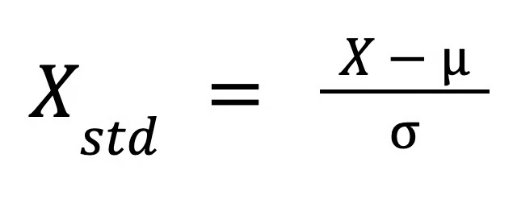
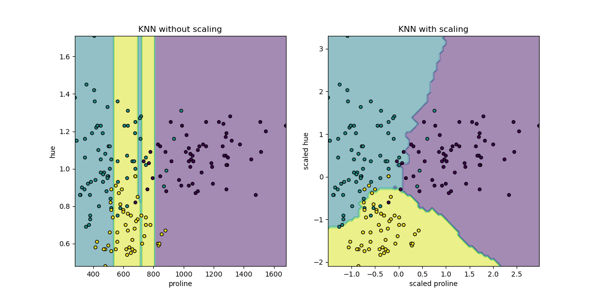

# ⚙️ Pré-processamento de Dados

O **pré-processamento** é uma etapa fundamental em Machine Learning, pois garante que os dados estejam em um formato adequado para os algoritmos.  
Aqui abordaremos:

- Normalização  
- Padronização  
- Feature Scaling (com exemplo prático em KNN)  
- Codificação de variáveis  

---

## 🔹 Normalização

### O que é?

A **normalização** refere-se ao processo de ajustar valores em escalas diferentes para uma **escala comum**.  
Ela é particularmente útil quando a distribuição dos dados é desconhecida ou não segue uma distribuição gaussiana.

### Principais tipos de normalização

- **Min-Max (mínimo e máximo)**  
  Redimensiona os valores para um intervalo específico, geralmente `[0, 1]`.  
  Exemplo: o menor valor vira `0`, o maior vira `1`.

- **Logarithmic Scaling (normalização logarítmica)**  
  Aplica uma transformação logarítmica para reduzir o impacto de valores muito altos.

- **Escala decimal**  
  Desloca o ponto decimal para tornar os valores mais manejáveis sem alterar as diferenças relativas.

- **Normalização da média (centralização da média)**  
  Subtrai a média de cada valor, centralizando os dados em torno de `0`.

### Quando utilizar?

- Quando os dados possuem **distribuição desconhecida ou não-gaussiana**  
- Em **algoritmos baseados em distância** (KNN, SVM, KMeans), para evitar que variáveis com escalas maiores dominem os cálculos.

### Exemplo com Scikit-Learn

```python
from sklearn.preprocessing import MinMaxScaler
import numpy as np

# Exemplo: valores de tamanho de casas
X = np.array([[500], [1000], [1500], [2000]])

scaler = MinMaxScaler()
X_scaled = scaler.fit_transform(X)

print("Original:", X.ravel())
print("Normalizado:", X_scaled.ravel())
```

## 🔹 Padronização

Enquanto a normalização ajusta os dados para um intervalo específico, a padronização transforma os dados para que tenham:

- Média = 0

- Desvio padrão = 1

Essa técnica é também conhecida como z-score scaling.

Fórmula
<p align="center">  </p>

Onde:

- X é o valor original

- μ é a média

- σ é o desvio padrão

Exemplo com Scikit-Learn
```python
from sklearn.preprocessing import StandardScaler
import numpy as np

# Exemplo: valores de preços de casas
X = np.array([[100000], [200000], [400000], [800000]])

scaler = StandardScaler()
X_scaled = scaler.fit_transform(X)

print("Original:", X.ravel())
print("Padronizado:", np.round(X_scaled.ravel(), 2))
```
X é o valor original,
mu é a média do recurso, e
sigma é o desvio padrão do recurso.
Essa fórmula redimensiona os dados de forma que sua distribuição tenha uma média de 0 e um desvio padrão de 1.
```python
from sklearn.preprocessing import StandardScaler
scaler = StandardScaler()
X_scaled = scaler.fit_transform(X)
```

🔹 Feature Scaling (Escalonamento de Variáveis)

O escalonamento de variáveis é crucial em algoritmos baseados em distâncias, como o KNN.
A imagem abaixo mostra como os limites de decisão mudam drasticamente dependendo se os dados foram escalados ou não.

<p>  </p>

> Retirado da documentação oficial do [Scikit-Learn.org](https://scikit-learn.org/stable/auto_examples/preprocessing/plot_scaling_importance.html#sphx-glr-auto-examples-preprocessing-plot-scaling-importance-py)

No lado esquerdo, sem escalonamento, a variável "__proline__" domina a decisão do modelo, pois seus valores variam aproximadamente entre 0 e 1.000, enquanto a variável "__hue__" varia apenas entre 1 e 10. Isso faz com que diferenças em “__hue__” sejam praticamente ignoradas.

No lado direito, após aplicar o StandardScaler, ambas as variáveis são transformadas para uma escala aproximada entre -3 e 3, permitindo que o modelo leve em consideração de forma equilibrada as duas variáveis. Assim, a estrutura de vizinhança muda completamente e os limites de decisão se tornam mais representativos.

🔹 Codificação de Variáveis

Preferencialmente feito utilizando pandas

Muitos algoritmos não trabalham diretamente com variáveis categóricas, sendo necessário convertê-las em valores numéricos.

One-Hot Encoding

Cria colunas binárias para cada categoria.
Exemplo: cor = [vermelho, azul, verde] vira cor_vermelho, cor_azul, cor_verde.
```python
import pandas as pd
from sklearn.preprocessing import OneHotEncoder

df = pd.DataFrame({"Cor": ["vermelho", "azul", "verde", "azul"]})

encoder = OneHotEncoder(sparse_output=False)
encoded = encoder.fit_transform(df[["Cor"]])

print(pd.DataFrame(encoded, columns=encoder.get_feature_names_out(["Cor"])))
```
Label Encoding

Atribui inteiros para cada categoria.
Exemplo: vermelho=0, azul=1, verde=2.
```python
from sklearn.preprocessing import LabelEncoder

le = LabelEncoder()
labels = le.fit_transform(df["Cor"])
print(labels)
```