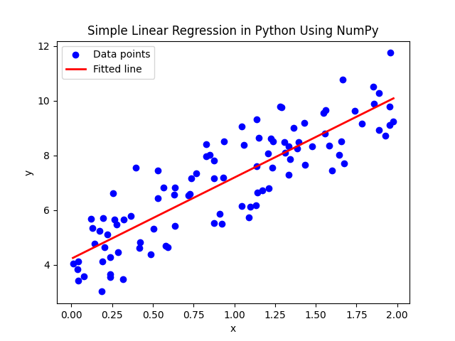

# 📈 Modelos de Regressão no Scikit-Learn

A **regressão** é uma das tarefas fundamentais em Machine Learning, usada para prever valores numéricos contínuos com base em variáveis independentes.  

O Scikit-Learn oferece desde modelos lineares simples até técnicas avançadas de regularização e ensemble.  

Neste guia, abordaremos:

- Regressão Linear  
- Regressão Não Linear
- Regressão Ridge  
- Regressão Lasso  
- Elastic Net  
- Árvores de Regressão e Random Forest  
- Gradient Boosting Regressor  

---

## 🔹 Regressão Linear

### O que é?
Assume que existe uma relação linear entre as variáveis independentes (**X**) e a variável dependente (**y**).  

### Fórmula
\[
y = \beta_0 + \beta_1 x_1 + \beta_2 x_2 + \dots + \beta_n x_n
\]

Onde:  
- \( \beta_0 \) é o intercepto  
- \( \beta_i \) são os coeficientes  
- \( x_i \) são as variáveis independentes  

### Exemplo em Python
```python
from sklearn.linear_model import LinearRegression
import numpy as np

# Dados de exemplo: horas de estudo (X) e nota final (y)
X = np.array([[1], [2], [3], [4], [5]])
y = np.array([50, 55, 65, 70, 80])

model = LinearRegression()
model.fit(X, y)

print("Coeficiente:", model.coef_)
print("Intercepto:", model.intercept_)
print("Previsão para 6 horas de estudo:", model.predict([[6]]))
```
<p align="center">  </p>

## 🔹 Regressão Não Linear
**Nem toda relação é linear**. Para casos não lineares, podemos:

Transformar features: **aplicar polinômios ou funções não lineares**.

```python
from sklearn.preprocessing import PolynomialFeatures
from sklearn.linear_model import LinearRegression
from sklearn.pipeline import Pipeline

# Transformacao polinomial de grau 2
poly_model = Pipeline([
    ('poly', PolynomialFeatures(degree=2)),
    ('linear', LinearRegression())
])

poly_model.fit(X, y)
print("Previsão para 6 horas:", poly_model.predict([[6]]))
```

<p align="center">  </p>

## 🔹 Regressão Ridge (L2)
### O que é?
Aplica penalização L2 aos coeficientes, evitando que fiquem muito grandes. Reduz overfitting.

```python
from sklearn.linear_model import Ridge

ridge = Ridge(alpha=1.0)
ridge.fit(X, y)

print("Coeficientes Ridge:", ridge.coef_)
```
## 🔹 Regressão Lasso (L1)
### O que é?
Aplica penalização L1, podendo reduzir coeficientes irrelevantes a zero, realizando seleção automática de variáveis.

```python
from sklearn.linear_model import Lasso

lasso = Lasso(alpha=0.1)
lasso.fit(X, y)

print("Coeficientes Lasso:", lasso.coef_)
```
## 🔹 Elastic Net (L1 + L2)
### O que é?
**Combina** as penalizações L1 (seleção de variáveis) e L2 (estabilidade dos coeficientes).

```python
from sklearn.linear_model import ElasticNet

elastic = ElasticNet(alpha=0.1, l1_ratio=0.5)
elastic.fit(X, y)

print("Coeficientes ElasticNet:", elastic.coef_)
```

📊 Comparação entre Modelos de Regressão
| Modelo            | Vantagens                                | Desvantagens                         | Quando Usar                            |
| ----------------- | ---------------------------------------- | ------------------------------------ | -------------------------------------- |
| Linear Regression | Simples, interpretável                   | Limitações em dados não-lineares     | Relações lineares simples              |
| Ridge             | Reduz overfitting, coeficientes estáveis | Não zera variáveis irrelevantes      | Muitos atributos correlacionados       |
| Lasso             | Seleção de variáveis automática          | Pode eliminar variáveis relevantes   | Muitas variáveis irrelevantes          |
| Multi Variable Regression       | Consegue captar relações mais complexas          | Mais difícil ajustar e susetível a overfitting | Relações não lineares     |