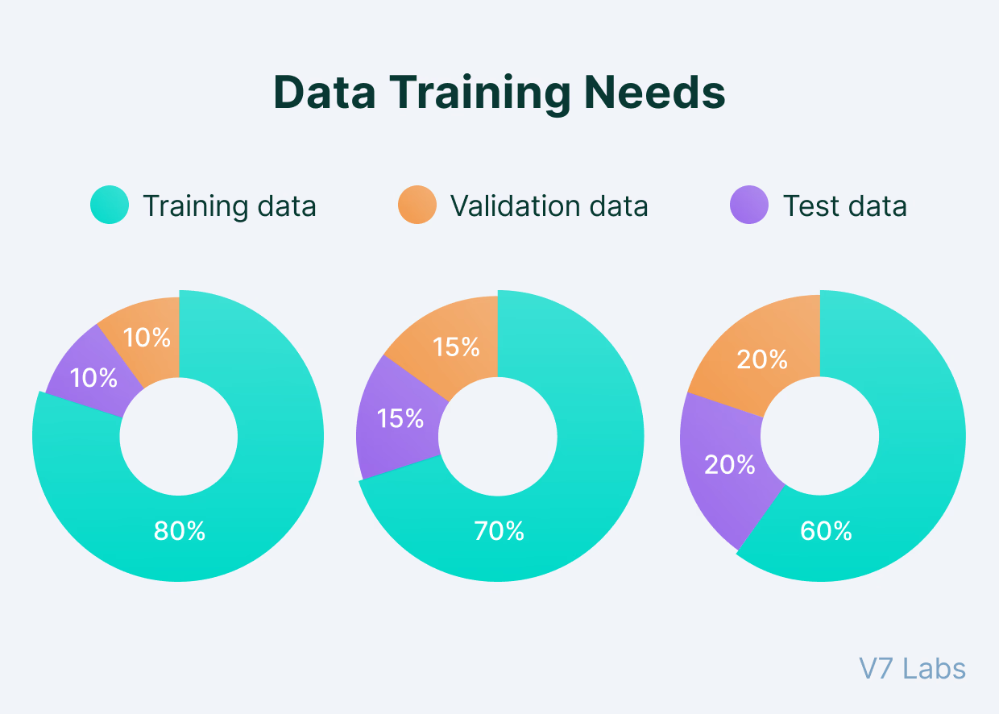

# 🧪 Técnicas de Validação de Modelos no Scikit-Learn

A **validação de modelos** é essencial para avaliar a **performance** e a **generalização** de algoritmos de Machine Learning.  
Evita **overfitting** (quando o modelo aprende demais os dados de treino) e garante previsões confiáveis em dados novos.

As principais técnicas incluem:

- **Train/Test Split**  
- **Cross-Validation (K-Fold, Stratified K-Fold)**  
- **Leave-One-Out (LOO)**  
- **Shuffle Split**  

---

## 🔹 Train/Test Split

### O que é?
Divide o dataset em **conjunto de treino** e **conjunto de teste**.  
- Treino → modelo aprende padrões  
- Teste → modelo é avaliado

### Exemplo em Python
```python
from sklearn.model_selection import train_test_split
from sklearn.linear_model import LinearRegression
import numpy as np

# Dados de exemplo
X = np.arange(10).reshape(-1, 1)
y = np.array([1, 3, 5, 7, 9, 11, 13, 15, 17, 19])

# Divisão: 70% treino, 30% teste
X_train, X_test, y_train, y_test = train_test_split(X, y, test_size=0.3, random_state=42)

model = LinearRegression()
model.fit(X_train, y_train)

print("Score no treino:", model.score(X_train, y_train))
print("Score no teste:", model.score(X_test, y_test))
```
> O parâmetro ***random_state*** garante reprodutibilidade.

## 🔹 Cross-Validation (CV)
### O que é?

1. O dataset é dividido em K partes (folds).

2. O modelo é treinado em K-1 folds e testado no fold restante

3. O processo se repete K vezes, cada fold sendo usado como teste uma vez

A média dos scores fornece uma estimativa mais robusta da performance

### Exemplo com K-Fold
```python
from sklearn.model_selection import cross_val_score
from sklearn.linear_model import LinearRegression
import numpy as np

X = np.arange(10).reshape(-1, 1)
y = np.array([1,3,5,7,9,11,13,15,17,19])

model = LinearRegression()

# 5-Fold Cross-Validation
scores = cross_val_score(model, X, y, cv=5)
print("Scores de cada fold:", scores)
print("Média dos scores:", scores.mean())
```

### Stratified K-Fold

Usado principalmente em **classificação**, mantém a **proporção de classes** em cada fold.

```python
from sklearn.model_selection import StratifiedKFold

# Exemplo para classificação
from sklearn.datasets import load_iris
from sklearn.ensemble import RandomForestClassifier

iris = load_iris()
X = iris.data
y = iris.target

skf = StratifiedKFold(n_splits=5, shuffle=True, random_state=42)
model = RandomForestClassifier()

for train_idx, test_idx in skf.split(X, y):
    model.fit(X[train_idx], y[train_idx])
    score = model.score(X[test_idx], y[test_idx])
    print("Fold score:", score)
```

## 🔹 Leave-One-Out (LOO)
### O que é?

Caso extremo de **cross-validation**:

Cada amostra do dataset é usada uma vez como teste, o restante como treino

Bom para **datasets pequenos**, mas computacionalmente caro em datasets grandes
```python 
from sklearn.model_selection import LeaveOneOut

loo = LeaveOneOut()
scores = []

for train_idx, test_idx in loo.split(X):
    model.fit(X[train_idx], y[train_idx])
    scores.append(model.score(X[test_idx], y[test_idx]))

print("Score médio LOO:", np.mean(scores))
```

## 🔹 Shuffle Split  
### O que é?  

Gera múltiplas divisões aleatórias de treino/teste, útil para validar estabilidade do modelo.
```python
from sklearn.model_selection import ShuffleSplit

ss = ShuffleSplit(n_splits=5, test_size=0.3, random_state=42)
scores = cross_val_score(model, X, y, cv=ss)

print("Scores Shuffle Split:", scores)
print("Média:", scores.mean())
```

## 🔹 Comparação das Técnicas

| Técnica             | Vantagens                         | Desvantagens                       | Quando Usar                           |
| ------------------- | --------------------------------- | ---------------------------------- | ------------------------------------- |
| Train/Test Split    | Simples, rápido                   | Pode depender da divisão escolhida | Dados grandes e teste rápido          |
| K-Fold CV           | Mais robusto que train/test split | Computacionalmente mais caro       | Avaliação mais confiável              |
| Stratified K-Fold   | Mantém proporção de classes       | Igual ao K-Fold                    | Classificação, classes desbalanceadas |
| Leave-One-Out (LOO) | Máxima utilização dos dados       | Muito lento para datasets grandes  | Dados pequenos                        |
| Shuffle Split       | Avalia estabilidade do modelo     | Pode gerar folds semelhantes       | Testes rápidos em datasets médios     |

## 🔹 Dicas Práticas
1. Sempre use random_state para resultados reproduzíveis.

2. Para datasets pequenos, K-Fold ou LOO são mais confiáveis.

3. Para datasets grandes, train/test split ou ShuffleSplit são suficientes.

4. Combine com métricas adequadas:

   - Regressão → R², MSE, MAE

   - Classificação → Accuracy, F1, ROC-AUC

## 🔹 Exmplos de Separação de dados

A proporção de dados para cada função varia de caso para caso, mas no geral está entre alguma dessa situações: 

<p>  <p>