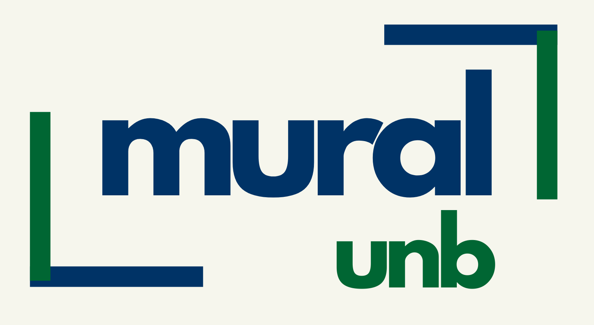

 

<!-- ESCUDOS DO PROJETO -->

  
  
  
  
  
  

  
  

<h1 align="center">
   
  
</h1>

 
  🌎 Languages: <a href="./readme/README.en.md">English</a> | <a href="./README.md">Português</a>

<h3 align="center">Plataforma de mural digital da Universidade de Brasília (UnB)</h3>

<!-- 

  
  
  

-->

  <a href="#sobre">Sobre</a> •
  <a href="#principais-funcionalidades">Funcionalidades</a> •
  <a href="#como-usar">Como Usar</a> •
  <a href="#🔗-links">Links</a> •
  <a href="#🙋‍♂️-equipe">Equipe</a> •
  <a href="#🧾-licença">Licença</a> •
  <a href="#🤝-contribuição">Contribuição</a> •
  <a href="#📜-código-de-conduta">Código de Conduta</a>

## Demo

#### 🚧 Em desenvolvimento

## Sobre

O **Mural UnB** é uma plataforma digital projetada para centralizar e recomendar oportunidades acadêmicas e profissionais dentro da Universidade de Brasília (UnB).  

O objetivo é criar uma **experiência personalizada**, onde os estudantes possam facilmente descobrir oportunidades alinhadas aos seus interesses e histórico acadêmico.  
Ao analisar o perfil do usuário, a plataforma recomenda as opções mais relevantes e envia notificações sobre novas vagas.  

Inclui oportunidades como:  
- **Empresas juniores**  
- **Laboratórios de pesquisa**  
- **Iniciação científica (PIBICs)**  

Em resumo, o Mural UnB funciona como um **mural virtual**, que vai além de apenas listar oportunidades — ele **ajuda os estudantes a se conectarem com as oportunidades certas, no momento certo**.  

## Principais Funcionalidades

#### 🚧 Em desenvolvimento

## Como Usar

#### 🚧 Em desenvolvimento

## 🔗 Links
- [Demo (GitHub Pages)](https://unb-mds.github.io/Mural-UnB/)  
- [Figma - Hub do Projeto](https://www.figma.com/board/S9uS0BvdNKOcX2gYhVtMDY/Mural-UnB-MDS?node-id=0-1&p=f&t=3mDHHLQPSOljbISN-0)  
- [Repositório GitHub](https://github.com/unb-mds/Mural-UnB) 

## 🙋‍♂️ Equipe

<table>
  <tr>
    <td align="center">
      <a href="https://github.com/TiagoSBittencourt">
        
         <b>Tiago Bittencourt</b>
      </a>
       SM • ML & Agent Developer
    </td>
    <td align="center">
      <a href="https://github.com/Karmantinedev">
        
         <b>João Gonzaga</b>
      </a>
       PO • Backend Developer
    </td>
    <td align="center">
      <a href="https://github.com/luanludry">
        
         <b>Luan Ludry</b>
      </a>
       Frontend Developer
    </td>
    <td align="center">
      <a href="https://github.com/Lucasft16">
        
         <b>Lucas Fujimoto</b>
      </a>
       Backend Developer
    </td>
    <td align="center">
      <a href="https://github.com/MariaClara-Canuto">
        
         <b>Maria Canuto</b>
      </a>
       Frontend Developer
    </td>
    <td align="center">
      <a href="https://github.com/apptrx">
        
         <b>Matheus Saraiva</b>
      </a>
       Backend Developer
    </td>
  </tr>
</table>

## 🧾 Licença

[MIT](./LICENSE)

## 🤝 Contribuição

Contribuições da comunidade são muito bem-vindas! 🎉  
Veja nosso [CONTRIBUTING.md](./.github/CONTRIBUTING.md) para saber como começar.

## 📜 Código de Conduta

Este projeto segue um **Código de Conduta** para garantir um ambiente acolhedor.  
Assim que disponível, você pode acessá-lo aqui: [CODE_OF_CONDUCT.md](./.github/CODE_OF_CONDUCT.md).

---

> Site [______.com]() &nbsp;&middot;&nbsp;
> GitHub [Mural-UnB](https://github.com/unb-mds/Mural-UnB) &nbsp;&middot;&nbsp;
> Instagram [@______]() &nbsp;&middot;&nbsp;
> email [___@gmail.com]()